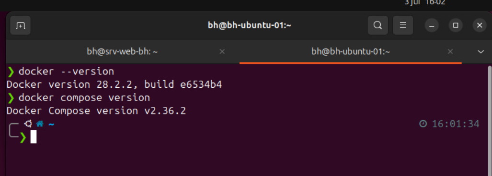
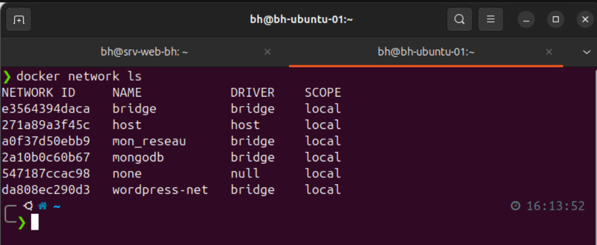
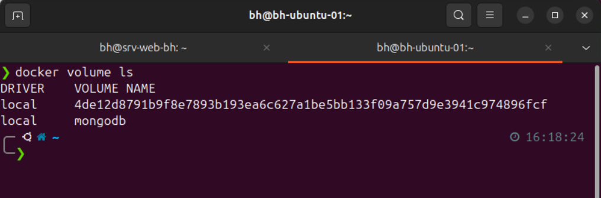
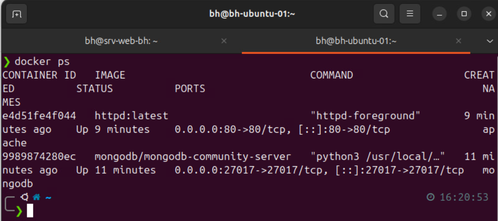
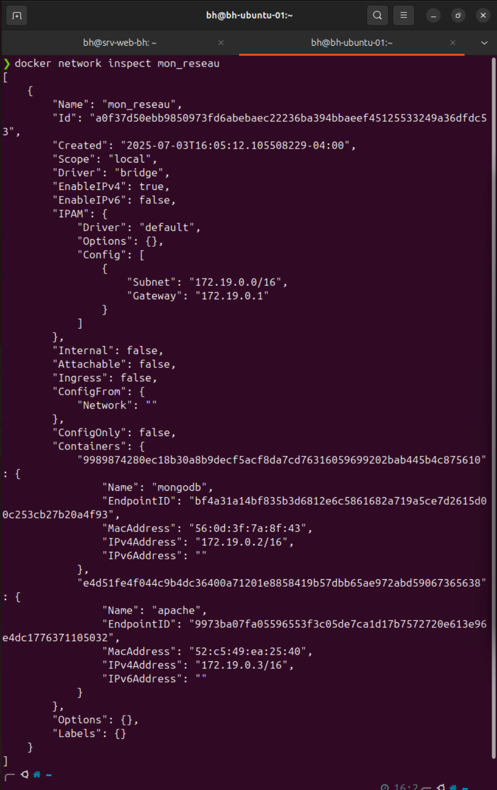
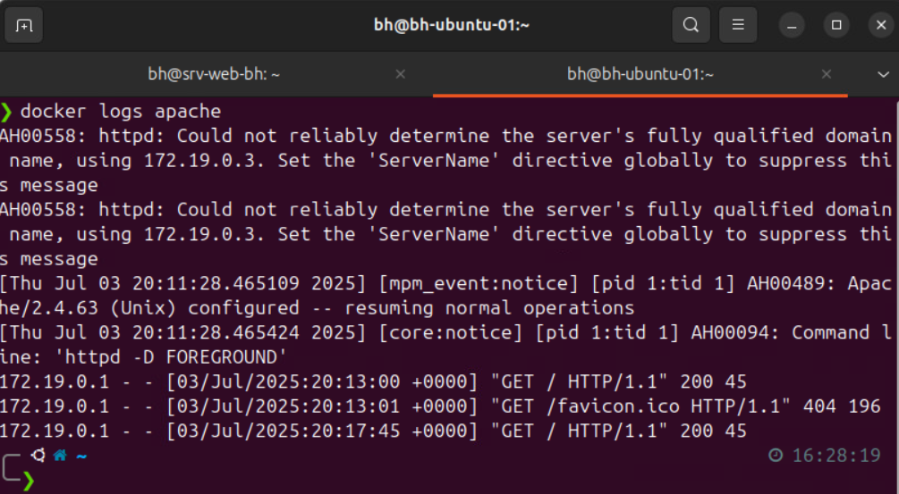
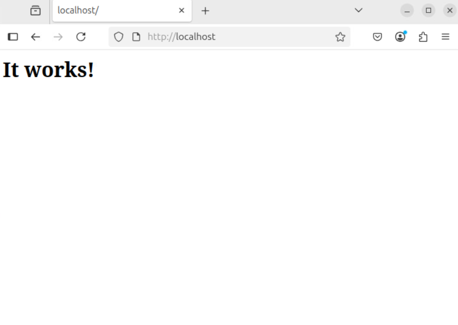
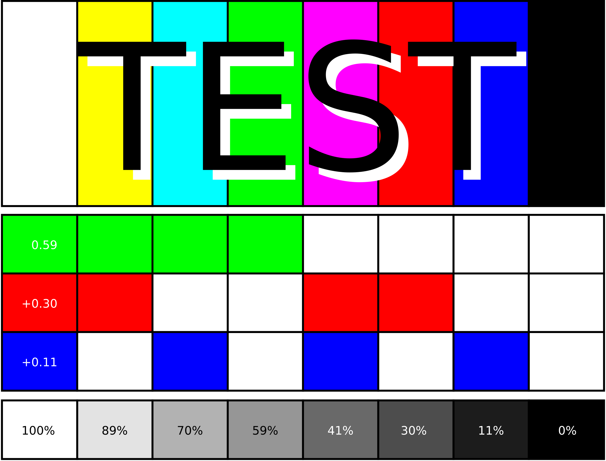

<!-- PROJECT LOGO -->
 

  
  
  <h3 align="center">Travail pratique 2 - Docker</h3>

  <h4 align="center">Billy Halle</h4>

  <h5>07/03/2025</h5>

  

    Installation un système de conteneurs et création de conteneurs
     
    <a href="#about"><strong>Explore the screenshots »</strong></a>
       
       
      <a href="https://github.com/majeurbilly/ISS---TravailPratique02/issues/new?assignees=&labels=bug&template=01_BUG_REPORT.md&title=bug%3A+">Report a Bug</a>
      ·
      <a href="https://github.com/majeurbilly/ISS---TravailPratique02/issues/new?assignees=&labels=enhancement&template=02_FEATURE_REQUEST.md&title=feat%3A+">Request a Feature</a>
      ·
      <a href="https://github.com/majeurbilly/ISS---TravailPratique02/issues/new?assignees=&labels=question&template=04_SUPPORT_QUESTION.md&title=support%3A+">Ask a Question</a>
  

  ## Table of Contents
  <ol>
    <li>
      <a href="#about">About</a>
      <ul>
        <li><a href="#built-with">Built With</a></li>
      </ul>
    </li>
    <li>
      <a href="#getting-started">Getting Started</a>
      <ul>
        <li><a href="#prerequisites">Prerequisites</a></li>
        <li><a href="#installation">Installation</a></li>
      </ul>
    </li>
    <li><a href="#usage">Usage</a></li>
    <li><a href="#monitoring-tools-overview">Monitoring Tools Overview</a></li>
    <li><a href="#authors--contributors">Authors & Contributors</a></li>
    <li><a href="#acknowledgments">Acknowledgments</a></li>
  </ol>

<!-- ABOUT THE PROJECT -->
## About
Ce projet comporte deux sections; 

  La section 1, concerne la vérifier l'installation de Docker Engine et Docker Compose, puis de créer un réseau Docker privé avec des conteneurs Apache et MongoDB, en documentant toutes les étapes de vérification.

  La section 2, implique la personnalisation et le déploiement d'une image Docker pour Drupal, en y intégrant des éléments spécifiques et en la connectant à une base de données PostgreSQL distincte, afin de valider une installation web fonctionnelle.

 

    
    
 

 
🛠️ Section 1 :  
 
Version de Docker Engine et Docker Compose :

 
 
Lister tous les réseaux Docker présents sur le système :

 
 
Liste de tous les volumes de données gérés par Docker sur le système :

 
 
Lister des conteneurs Docker qui sont actuellement en cours d'exécution sur votre système :

 
 
Afficher des informations très détaillées sur le réseau Docker nommé "mon_reseau" :

 
 
Afficher les journaux (logs) du conteneur Docker nommé "apache" :

 
 
http://localhost

 
 

### Built With

- **Linux**
 **Section 1 :**
- **Docker Engine version 28.2.2**
- **Docker Compose version v2.36.2**
 **Section 1 :**

## Getting Started

### Prerequisites

To work with this project, you need to have:

- **EXEMPLE**
- **EXEMPLE**
- **ETC** 

### Installation

1. Open your **terminal**.
2. Install `...` 
3. Install `...` 
4. Install `...` 
5. Run the program:
   `...` 

## Usage

### Backend

1. In `main`...
2. Run:
   `...` 

## Monitoring Tools Overview

### **EXEMPLE**
...

### **EXEMPLE**
...

### **EXEMPLE**
...

## Authors & Contributors

...

## Acknowledgments

Remerciment:

* [EXEMPLE](https://EXEMPLE.io/)
* [EXEMPLE](https://EXEMPLE.com/)

(<a href="#readme-top">back to top</a>)

