<!-- PROJECT LOGO -->
 

  <h3 align="center">Travail pratique 2 - Docker</h3>

  <h4 align="center">Billy Halle</h4>

  <h5>07/03/2025</h5>

  

    Installation un système de conteneurs et création de conteneurs
     
    <a href="#description"><strong>Captures d'écran 🖼️»</strong></a>
       
       
      <a href="https://github.com/majeurbilly/ISS---TravailPratique02/issues/new?assignees=&labels=bug&template=01_BUG_REPORT.md&title=bug%3A+">Report a Bug</a>
      ·
      <a href="https://github.com/majeurbilly/ISS---TravailPratique02/issues/new?assignees=&labels=enhancement&template=02_FEATURE_REQUEST.md&title=feat%3A+">Request a Feature</a>
      ·
      <a href="https://github.com/majeurbilly/ISS---TravailPratique02/issues/new?assignees=&labels=question&template=04_SUPPORT_QUESTION.md&title=support%3A+">Ask a Question</a>
  

  ## Table des matières
  <ol>
    <li>
      <a href="#description">Description</a>
      <ul>
        <li><a href="#développé-avec">Développé avec</a></li>
      </ul>
    </li>
    
  </ol>

<!-- ABOUT THE PROJECT -->
## Description
Ce répertoire contient les fichiers nécessaires pour construire une 
image Docker personnalisée de Drupal, incluant le thème Bootstrap 3. 
Il est également configuré pour interagir avec une base de données PostgreSQL.

 

    Captures d'écran section 2 🖼️
    
 

  
Construction d'une image Docker à partir du Dockerfile présent dans le répertoire courant :
 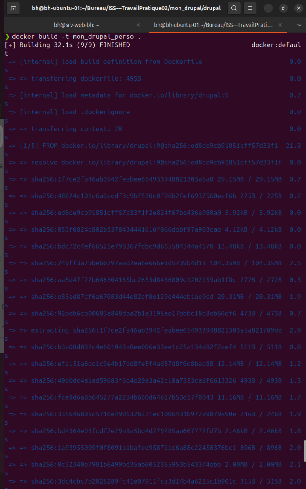
 
 
 Liste toutes les images Docker stockées localement sur la machine :
 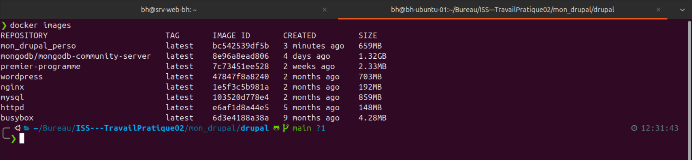
  
 
Lister tous les conteneurs Docker actuellement en cours d'exécution sur le système :

  
 
Créer et de démarrer un nouveau conteneur Docker en lui attribuant le nom drupal-postgres : 
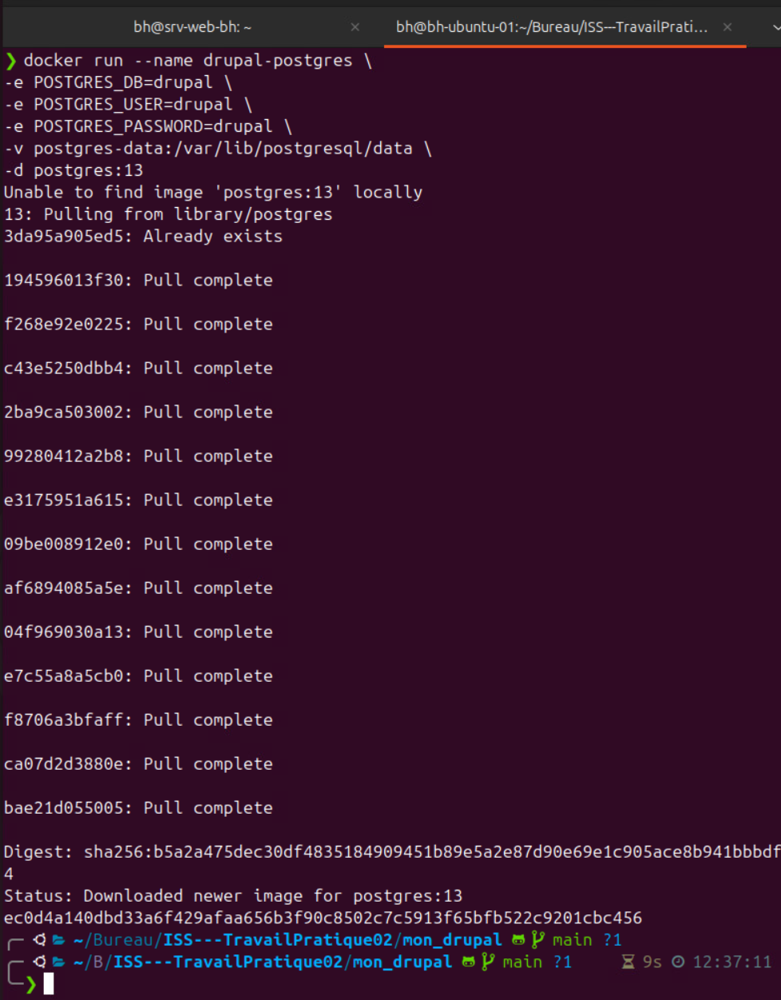
  
 
Crée un nouveau volume Docker persistant nommé drupal-data 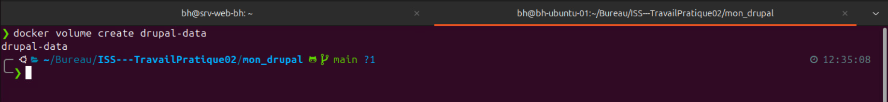
  
 
Lister tous les conteneurs Docker actuellement en cours d'exécution sur le système : 
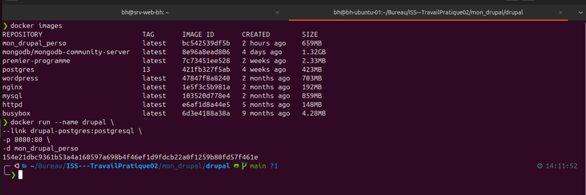
  
 
Lister tous les conteneurs Docker actuellement en cours d'exécution sur le système :
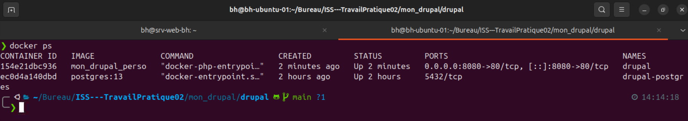
  
 L'image présente la première étape de l'installation de Drupal 9.5.11 :
 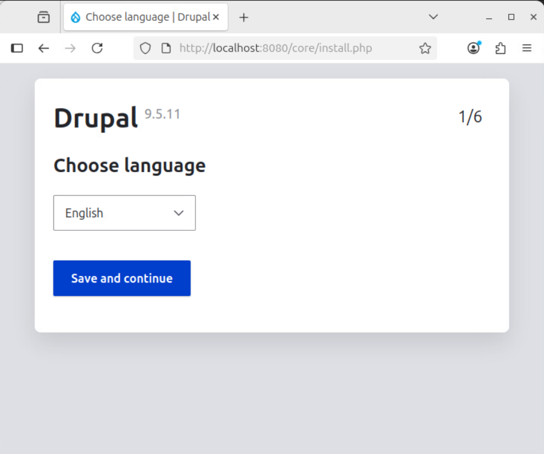
  
L'image présente la deuxième étape de l'installation de Drupal 9.5.11 :  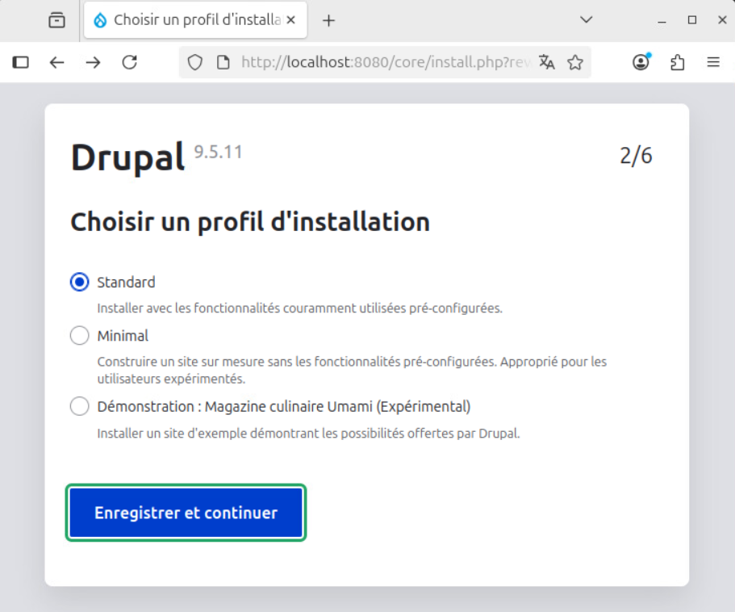
  
L'image illustre la page de configuration de la base de données de l'installation de Drupal 9.5.11  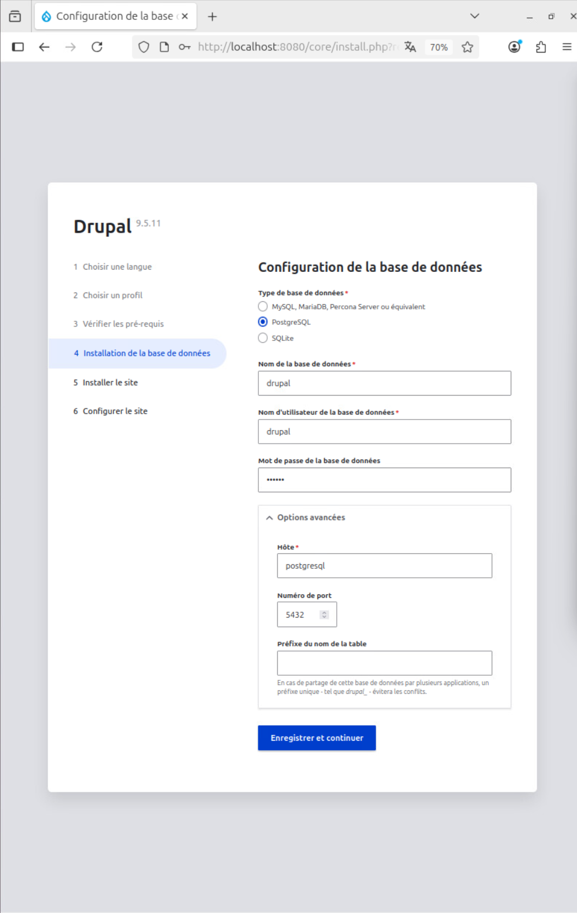
  
L'image montre la page d'accueil de l'interface d'administration de Drupal : 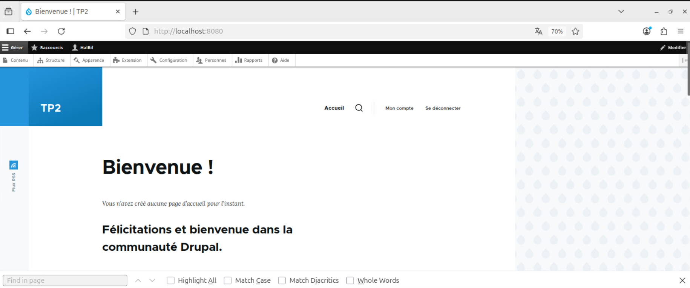
  
L'image présente la page d'administration de Drupal permettant d'ajouter un nouveau thème : 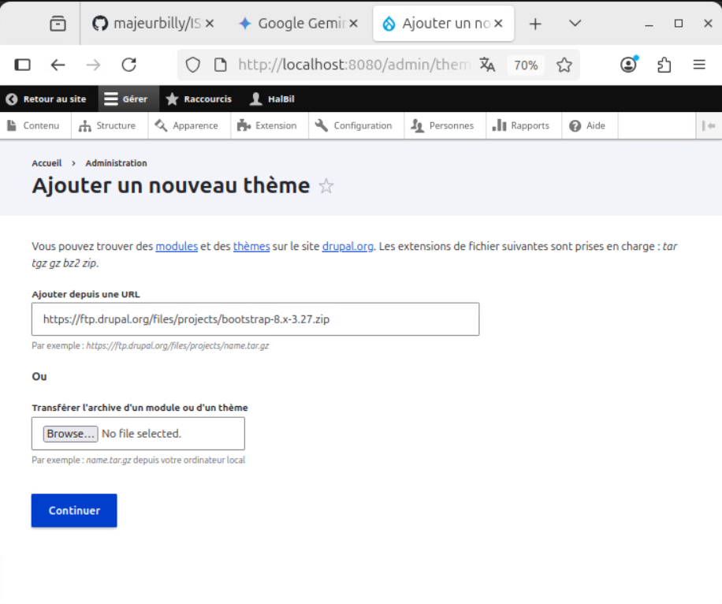
  
L'image montre la page du gestionnaire de mises à jour de Drupal, confirmant l'ajout réussi des fichiers et du thème Bootstrap : 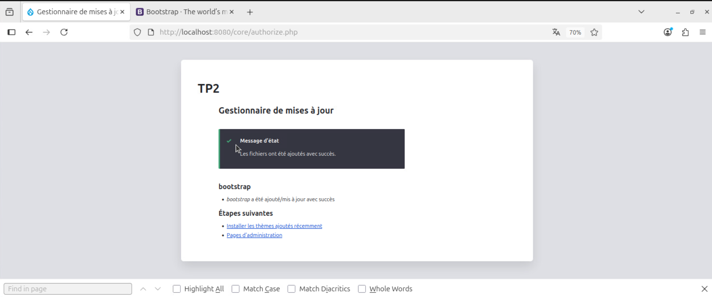
 

 

